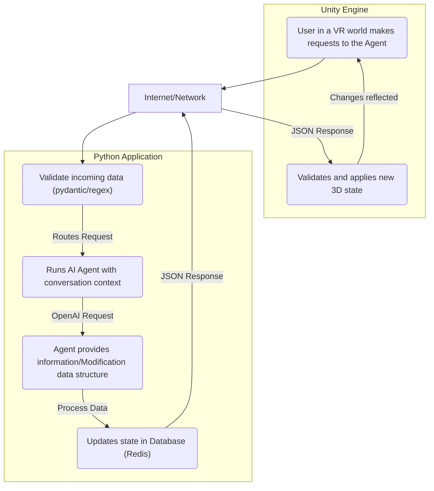

# AI Agents + Virtual Reality
## System Overview
AI-powered agent-based system for dynamic modification of Virtual Reality environment elements, leveraging Python and OpenAI libraries to harness ChatGPT capabilities. This enables manipulation of 3D elements, including movement, color, and state changes, as desired. The system integrates three data sources: Vector Store for structured data, Google Workspace (Drive) for file management, and Redis for dynamic, cached data and real-time information. This allows agents to access real-time data, static information, and conversational context, facilitating seamless interactions within the VR environment.

## Features
- AI Integration: Seamless connection to a ChatGPT agent for interpreting natural language commands into structured data templates.
- Unity Interoperability: Direct control over Unity ConstantForce.Force, ConstantForce.RelativeTorque, Renderer.Color, and TextMeshPro states via structured JSON responses.
- API Management: Handled by FastAPI, which facilitates both synchronous and streaming endpoints.

## In-Engine Experience Video
Demonstration of the system's core functionality: real-time, interactive command execution within the virtual reality environment.

[](https://youtu.be/-t16E0ieU7k)

## Architecture Diagram
High-level diagram illustrating the system data flow.



## Data Flow
- User Input: A user in the Unity client sends a natural language command to the Python API server.
- AI Processing: The user request is forwarded to the AI agent, providing context retrieved from the conversation history that was initialized.
- State Generation: The AI agent returns a structured JSON template defining the desired changes.
- Redis Update: The Database service validates and persists the new state.
- Unity Engine: The Unity system receives this data structure and applies it to the specified components.

## Data Structures
The virtual reality environment sends and updates the following data structure for analytical processing through agent function tools:

```json
{
    "Id": "ae89ab88-6d94-4235-b8f1-68c419d9d968",
    "Tag": "chair",
    "Name": "chair_livingroom",
    "Transform": {
        "Position": {
            "X": 13.7924623,
            "Y": -0.5499997,
            "Z": 7.930001
        },
        "Rotation": {
            "X": 5.40021574E-08,
            "Y": -0.9496292,
            "Z": -2.83122063E-07
        },
        "Scale": {
            "X": 1.0,
            "Y": 1.5,
            "Z": 0.5
        },
        "Reshape": 1.5,
    },
    "Components": {
        "ConstantForce": {
            "Force": {
                "X": 0.0,
                "Y": 9.83,
                "Z": 0.0
            },
            "RelativeTorque": {
                "X": 4.76,
                "Y": 0.0,
                "Z": 0.0
            }
        },
        "Color": "#FF0000"
    }
}
```

The AI agent can generate the following data structure to enforce new states in the virtual reality environment.
```json
{
    "Tag": "sofa",
    "Properties": [{
         "Name": "Components.ConstantForce.Force.Y",
         "State": 9.83
      },
      {
         "Name": "Components.ConstantForce.RelativeTorque.X",
         "State": 4.76
      },
      {
         "Name": "Components.Color",
         "State": "#0000FF"
      },
      {
         "Name": "Transform.Reshape",
         "State": 0.5
      }
   ]
}
```

## Folder Structure
Separation of concerns across both Python and C# (Unity Engine) projects:

Orchestrator/ (Python OpenAI)
```text
Orchestrator/
├── config/                 # Environment variables and credential management
├── controllers/            # API endpoints (routers) and input validation
├── core/                   # Shared helpers, utilities, and main application logic
├── schemas/                # Pydantic data models for API requests/responses
├── prompts/                # Prompt configuration and template storage
├── repositories/             # Data access layer (Redis interface)
├── services/               # OpenAI agent interaction, business logic
│   ├── tools/              # Agent function/tool definitions
├── server.py                 # FastAPI application entry point
```


Assets/ (Unity Engine)
```text
Assets/
├── Assets/                 # Materials, Prefabs, Scenes
├── Scripts/                # C# Source Code
│   ├── Data/               # Data management and processing
│   │   ├── Models/         # API request/response models (C# structs/classes)
│   │   ├── ScriptableObjects/ # Configurable interaction elements
│   ├── Config/             # Environment variable and property management
│   ├── Managers/           # 3D element management and processing
│   │   └── Networking/     # API communication logic
```

## API Endpoints
The Swagger UI API documentation is available at http://127.0.0.1:5000/docs

## Key Endpoints:
Endpoint | Method | Description
---|---|---
vr-state/session-states/stream | POST | A streaming endpoint that fetches information from the agent for display within the virtual environment.
vr-state/transform-template | PUT | Receives a template from the agent used by the Unity engine to update the states of virtual reality elements.
vr-state/session-states | POST | Saves the initial states of virtual reality elements and obtains conversation Ids, all subsequent updates within the session are kept within these conversations.
vr-state/session-states | DELETE | Automatically triggered when the Unity engine application closes, deleting all cached data associated with the conversation.

## 📊 Performance Metrics 

Key performance metrics for the LLM system, utilizing the gpt-5-nano-2025-08-07 model, were reviewed in the project platform dashboard in https://platform.openai.com/logs?api=traces.

Workflow | Transmission mode | Action | Average Latency (ms) | Notes
---|---|---|---|---
Json_Template_Generation_Flow | Synchronous | Generate JSON Template | 6.555 s (n = 6 processes) | Total time until the complete JSON payload is generated
Element_State_Inquiry_Flow | Streaming | Provides information | 7.403 s (n = 4 processes) | Total time until the complete text payload is generated
Element_State_Inquiry_Flow (Using Tools) | Streaming | Provides information | 14.023 s (n = 3 processes) | Total time until the complete text payload is generated

## Virtual Reality Environment
The virtual environment was developed using the Unity Engine, it represents a living room with objects to interact, as well as a keyboard where a user can type commands for an agent to follow.

### Assets
The virtual living space was assembled using a variety of prefabs and materials sourced from libraries available on the Unity Asset Store.

### State Management
A central GlobalManager script governs the registering of interactive elements within the scene, it also orchestrates changes to the state of the elements, such as modifying colors, updating text displayed on the TV screen, or toggling interaction modes.
- Physics Interaction
Elements within the environment are manipulated using Unity's built-in physics engine. Interactions involve applying physical forces and constraints, specifically:
    * ConstantForce: Used to apply continuous force to objects, creating consistent movement or floating effects.
    * RelativeTorque: Applied to induce rotational movement, allowing objects to spin or orient themselves dynamically within the virtual space.
    * Text: Displays information within the environment, it was strategically positioned upon the relevision to easily resemble a livingroom.
- A 3D keyboard present in the scene as the primary component for user-agent interaction.
- Response Handling: The environment can switch between receiving streaming and synchronous responses from the Python application. This functionality is toggled by clicking a dedicated UI button within the keyboard (represented visually by a cube icon).

# Local Environment Setup
To run this project locally, you will need: the Unity application, a Python service managed via Docker, a local Redis database, and authentication credentials for Google Cloud and OpenAI.

## Configuration Steps

Follow these steps to configure and run the application stack:

### 1. Configure Environment Variables

The services rely on environment variables provided by the .env file.

*   Locate the `.env-template` file in the repository root.
*   Make a copy and rename it to `.env`. This file is ignored by Git and will store here the local secrets.

Edit your new `.env` file to include the following information:

*   **`SERVICE_ACCOUNT_FILE`**: The local path to the Google Cloud Platform (GCP) credentials JSON file.
*   **`DRIVE_CONFIG_FILES`**: A comma-separated list of Google Drive file IDs required by the application (Prompt files configuration)
*   **`VECTOR_STORE_KNOWLEDGE_BASE_ID`**: The vector store id for accessing documentation files.

Ensure you have shared the permissions for the Google Drive files with the service account email associated with your GCP credentials file.

### 2. Set up the Database

The project uses a Redis database for state management. You need to ensure an instance is running.

*   **Redis Indexing:** The Redis database must be configured with an index that supports searching using the pattern `@Tag:{} @ConversationId:{}`, this can be executed by issuing the following command:

```bash
'FT.CREATE', "VRIdx",
    'ON', 'HASH',
    'PREFIX', 1, "VRState:",
    'SCHEMA',
        'Tag', 'TAG',
        'ConversationId', 'TAG'
```

### 3. Run the Python Service

Use Docker to build and run the Python service defined in the `Dockerfile` file.

Open a terminal in the project Orchestrator directory and run:

```bash
docker build -t ai-vr-control .
```

Run the container and pass the OPENAI_API_KEY environment variable:
```bash
docker run --network host -e OPENAI_API_KEY="$OPENAI_API_KEY" ai-vr-control
```

This command builds the Python image, uses the local .env file for configuration, and connects it to the local Redis instance.

### 4. Configure and Run the Unity Engine application
* The Unity Engine acts as the client and needs to know where your locally running HTTP services are located.
* Ensure that your operating system environment variables are accessible within the Unity environment (this may require specific configuration depending on your OS and Unity version).
* Set the following system environment variables before launching the Unity Editor:
    *   **`VR_TEMPLATE_API_ENDPOINT`**: Points to the local Python service template endpoint (e.g., http://localhost:5000/vr-state/transform-template).
    *   **`VR_STATE_API_ENDPOINT`**: Points to the local Python service state endpoint (e.g., http://localhost:5000/vr-state/session-states).
    *   **`VR_INFO_API_ENDPOINT`**: Points to the local Python service streaming endpoint (e.g., http://localhost:5000/vr-state/session-states/stream).
* Once the environment variables are set and the Python service is running, start the virtual reality environment.

Project Link: [github.com ai-vr-control](https://github.com/manuelftech/ai-vr-control)
