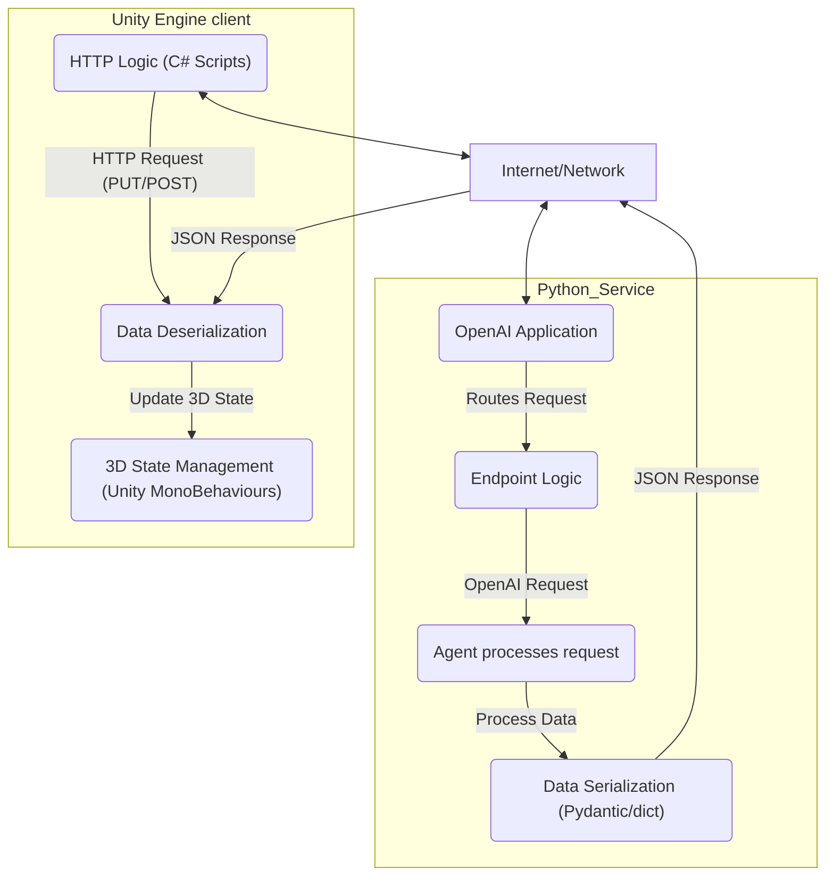

# Virtual Reality State Management via AI Agent
## Overview
This project provides a scalable system built with OpenAI that orchestrates real-time interaction between a ChatGPT agent and a Unity Engine client. It leverages Vector Stores from OpenAI, Google Drive, and Redis integration to manage 3D element states dynamically, responding to natural language prompts and leveraging private documentation for context. The system uses a 3D state approach to update specific Unity components, such as ConstantForce and Renderer.Color, offering an intuitive, AI-driven interface for complex virtual scene manipulation.

## Features
- AI Integration: Seamless connection to a ChatGPT agent for interpreting natural language commands into structured data templates.
- Real-time State Management: Utilizes Redis for efficient, low-latency storage and retrieval of 3D object states.
- FastAPI: A high-performance Python service for API management.
- Dynamic Asset Loading: Downloads necessary prompt files from Google Drive and context files (e.g., README.md from the project GitHub repo) from a vector store.
- Unity Interoperability: Direct control over Unity ConstantForce.Force, ConstantForce.RelativeTorque, Renderer.Color, and TextMeshPro states via structured JSON responses.
System Architecture.
- The architecture separates concerns into a modular system where the FastAPI service acts as the central coordinator.

## In-Engine Experience Video
Demonstration of the system's core functionality: real-time, interactive command execution within the virtual reality environment.

[](https://youtu.be/bB7ghHSNvR4)

## Architecture Diagram
High-level diagram illustrating the system data flow.



## Data Flow Overview
- User Input: A user in the Unity client sends a natural language command to the backend server.
- AI Processing: FastAPI forwards the prompt to the ChatGPT agent, providing context retrieved from the Vector Store and Google Drive assets.
- State Generation: The AI agent returns a structured JSON template defining the desired changes (e.g., "Change the red cube's color to blue and increase its upward force").
- Redis Update: The backend service validates and persists the new state in Redis.
- Unity Sync: The Unity client receives an HTTP update, applying the state changes to specific components.


## Virtual Environment Creation and Mechanics
The virtual environment was developed within the Unity game engine, leveraging several core functionalities and custom scripts to create an interactive, dynamic space.
### Environment Assets
The virtual living space was assembled using a variety of prefabs sourced from different libraries available on the Unity Asset Store. Key environmental elements such as sofas, the desk with books, keyboard, and the television were integrated as prefab elements.
## Core Mechanics
- State Management
A central GlobalManager script governs the interactive elements within the scene. This manager orchestrates changes to the state of various objects, such as modifying colors, updating text displayed on the TV screen, or toggling interaction modes.
- Physics Interaction
Elements within the environment are manipulated using Unity's built-in physics engine. Interactions often involve applying physical forces and constraints, specifically:
    * ConstantForce: Used to apply continuous force to objects, creating consistent movement or floating effects.
    * RelativeTorque: Applied to induce rotational movement, allowing objects to spin or orient themselves dynamically within the virtual space.
    * Text Input for External API Integration
- A 3D keyboard model present in the scene acts as the primary interface for user text input. This input mechanism facilitates interaction with an external AI agent.
- Input Redirection: The text entered via the 3D keyboard is captured and displayed on the 3D television element using a TextMeshPro component layered over the TV screen.
- Response Handling: The environment can switch between receiving streaming and synchronous responses from the FastAPI application. This functionality is toggled by clicking a dedicated UI button within the scene (represented visually by a cube icon on the 3D keyboard).

# Local Environment Setup

To run this project locally, you will need several components operational: the Unity application, a Python backend service managed via Docker, a local Redis database, and authentication credentials for Google Cloud and OpenAI.

## Configuration Steps

Follow these steps to configure and run the application stack:

### 1. Configure Environment Variables

The backend services rely on sensitive credentials and configurations that must be provided via environment variables.

*   Locate the `.env-template` file in the repository root.
*   Make a copy and rename it to `.env`. This file is ignored by Git and will store your local secrets.

Edit your new `.env` file to include the following information:

*   **`SERVICE_ACCOUNT_FILE`**: The local path to your Google Cloud Platform (GCP) credentials JSON file.
*   **`OPENAI_API_KEY`**: Your API key from OpenAI for accessing the language model (LLM_KEY).
*   **`DRIVE_CONFIG_FILES`**: A comma-separated list of Google Drive file IDs required by the application.
*   **`VECTOR_STORE_KNOWLEDGE_BASE_ID`**: Your vector store id for accessing private files.

**Important:** Ensure you have shared the permissions for the Google Drive files with the service account email associated with your GCP credentials file.

### 2. Set up the Database

The project uses a Redis database for state management. You need to ensure a local instance is running.

*   **Redis Indexing:** The Redis database must be configured with an index that supports searching using the pattern `@Tag:{} @ConversationId:{}`. This is typically handled in the Docker setup, but manual configuration may be required if running outside the provided containers.

### 3. Run the Backend Services (FastAPI & Redis)

Use Docker to build and run the backend services defined in the `Dockerfile` file.

Open a terminal in the project Orchestrator directory and run:

```bash
docker build -t my-app-image Orchestrator/Dockerfile
```

This command builds the FastAPI image, uses your local .env file for configuration, and connects it to the local Redis instance. 
### 4. Configure and Run the Unity Client 
The Unity Engine acts as the client and needs to know where your locally running backend services are located.
Launch the Unity Hub, open the project, and wait for the Unity Editor to load.
Ensure that your operating system environment variables are accessible within the Unity environment (this may require specific configuration depending on your OS and Unity version).
Set the following system environment variables in your local machine before launching the Unity Editor, or configure them directly within the Editor settings if possible:
VR_STATE_API_ENDPOINT: Should point to your local FastAPI service's state endpoint (e.g., http://localhost:5000/state).
VR_TEXT_STREAM_API_ENDPOINT: Should point to your local FastAPI service's info endpoint (e.g., http://localhost:5000/state-info).
Once the environment variables are set and the backend is running, press the Play button within the Unity Editor to start the virtual reality environment. 

The API will be available at http://127.0.0.1:5000.
## API Endpoints
The API documentation (Swagger UI) is available at 127.0.0.1.
## Key Endpoints:
Endpoint | Method | Description
---|---|---
vr-state/session-states | POST | A streaming endpoint that fetches information from the agent for display within the virtual environment.
vr-state/template | PUT | Receives a template from the agent used by the Unity engine to update the states of virtual reality elements.
vr-state/session-states | POST | Saves the initial states of virtual reality elements and obtains a conversation ID; all subsequent updates within the session are kept within this single conversation.
vr-state/session-states | DELETE | Automatically triggered when the Unity engine application closes, deleting all cached data associated with the session.
## Unity Client Integration
The Unity client is expected to interact with the system via HTTP requests.
## Data Structures
The Unity virtual environment facilitates the storage of element states both within the local environment and through transmission to the Python service for subsequent analytical processing.

```json
{
    "Id": "ae89ab88-6d94-4235-b8f1-68c419d9d968",
    "Tag": "chair",
    "Name": "chair_livingroom",
    "Transform": {
        "Position": {
            "X": 13.7924623,
            "Y": -0.5499997,
            "Z": 7.930001
        },
        "Rotation": {
            "X": 5.40021574E-08,
            "Y": -0.9496292,
            "Z": -2.83122063E-07
        },
        "Scale": {
            "X": 1.0,
            "Y": 1.5,
            "Z": 0.5
        },
        "Reshape": 1.5,
    },
    "Components": {
        "ConstantForce": {
            "Force": {
                "X": 0.0,
                "Y": 9.83,
                "Z": 0.0
            },
            "RelativeTorque": {
                "X": 4.76,
                "Y": 0.0,
                "Z": 0.0
            }
        },
        "Color": "#FF0000",
        "Text": "Streaming data provided by the agent",
    }
}
```

The AI agent responds with structured templates to enforce predictable state updates in Unity.
```json
{
    "Tag": "sofa",
    "Properties": [{
         "Name": "Components.ConstantForce.Force.Y",
         "State": 9.83
      },
      {
         "Name": "Components.ConstantForce.RelativeTorque.X",
         "State": 4.76
      },
      {
         "Name": "Components.Color",
         "State": "#0000FF"
      },
      {
         "Name": "Transform.Reshape",
         "State": 0.5
      },
      {
         "Name": "Components.Text",
         "State": "AI agent response"
      },
   ]
}
```

## Folder Structure
A clear separation of concerns is maintained across both Python and C# projects:

Orchestrator/ (Python OpenAI)
```text
Orchestrator/
├── config/                 # Environment variables and credential management
├── controllers/            # API endpoints (routers) and input validation
├── core/                   # Shared helpers, utilities, and main application logic
├── docs/                   # PDF documents ingested into the Vector Store
├── schemas/                # Pydantic data models for API requests/responses
├── prompts/                # Prompt configuration and template storage
├── repository/             # Data access layer (Redis interface)
├── services/               # OpenAI agent interaction, business logic
│   ├── tools/              # Agent function/tool definitions
├── main.py                 # FastAPI application entry point
└── requirements.txt        # Python dependencies
```


Assets/ (Unity Client Environment)
```text
Assets/
├── Assets/                 # Materials, Prefabs, Scenes
├── Scripts/                # C# Source Code
│   ├── Data/               # Data management and processing
│   │   ├── Models/         # API request/response models (C# structs/classes)
│   │   ├── ScriptableObjects/ # Configurable interaction elements
│   ├── Config/             # Environment variable and property management
│   ├── Managers/           # 3D element management and processing
│   │   └── Networking/     # API communication logic
```

## 📊 Performance Metrics 

Key performance metrics for the LLM system, utilizing the gpt-5-nano-2025-08-07 model, were reviewed in the project platform dashboard in https://platform.openai.com/logs?api=traces.

Workflow | Transmission mode | Action | Average Latency (ms) | Notes
---|---|---|---|---
Virtual reality template | Synchronous | Generate JSON Template | ms | Total time until the complete text payload is generated
States information | Streaming | Provide information | ms | Total time until the complete JSON payload is generated


Project Link: [github.com ai-vr-control](https://github.com/manuelftech/ai-vr-control)
