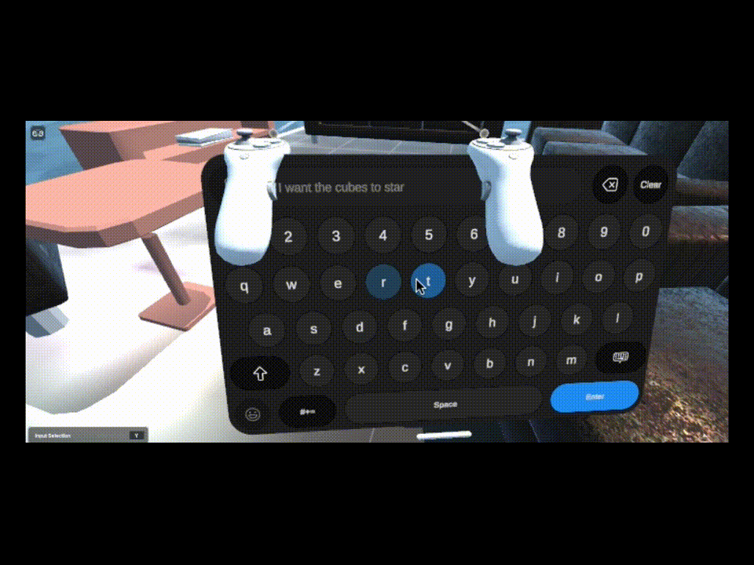

# ai-vr-control

# Python + Virtual Reality

Project to control a Virtual Reality environment using Python with ChatGPT

The Virtual Reality environment is programmed in C# for Unity Engine, init allows ChatGPT to change the state of the 3D elements of the scene.

Tools integrated and used for the creation, testing and validation of the project:
* OpenAI Python libraries (https://platform.openai.com/docs/overview)
* Unity Engine (https://unity.com/)
* Redis Database (https://redis.io/)

### Project Structure

*   `Assets/` Scenes, Materials and prefabs to create a 3D scene
    *   `Scripts/`Programming scripts in C# to control the environment
*   `Orchestrator/` Python OpenAI main application
    *   `config/` Extraction of configuration properties
    *   `controllers/` API Endpoints and receiving user input
    *   `core/` Main application managers
    *   `prompts/` Structure and templates for prompt configuration
    *   `repository/` Database integration
    *   `services/` Chatbot Tools